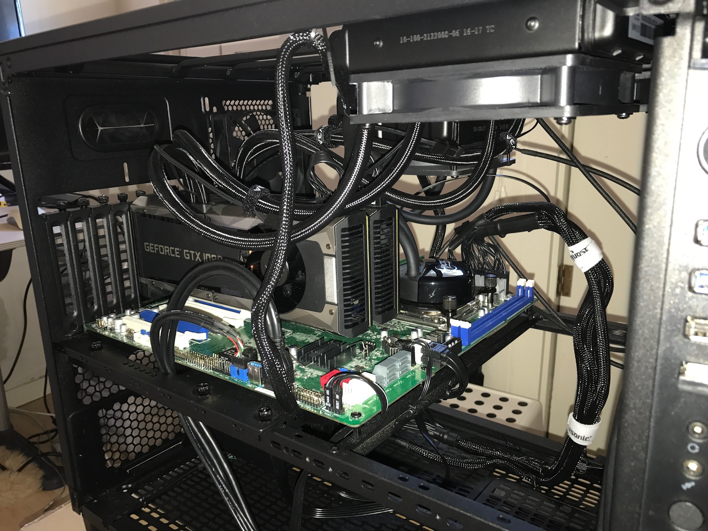

_________________
### Abstract
We present a deep recurrent neural network model with `soft visual attention' that learns to generate LaTeX markup of real-world math formulas from their images. Applying neural sequence generation techniques that have been very successful in the fields of machine translation and image/handwriting/speech recognition, captioning, transcription and synthesis, we present a image-to-sequence model that learns to produce syntactically and semantically correct \LaTeX ~markup code of over 150 words long and achieves a BLEU score of 89\%; the best reported score so far for the [Im2Latex](https://openai.com/requests-for-research/\#im2latex) problem.
We also visually demonstrate that the model learns to scan the image left-right / up-down much as a human would read text.  

The Paper (Link TBD)   

_________________
### Test Results
Two model variations are presented:  
* #### I2L-NOPOOL
  1. [Random Sample of Predictions](./I2L-NOPOOL/rand_sample_100.html )
  2. [Correct Predictions](./I2L-NOPOOL/matched_strs_100.html)
  3. [Incorrect Predictions (Mistakes)](./I2L-NOPOOL/unmatched_rand_sample.html)
  4. [Attention Scan Visualization](./I2L-NOPOOL/alpha)
  5. Model Training Charts (Link TBD)
  
* #### I2L-STRIPS
  1. [Random Sample of Predictions](./I2L-STRIPS/rand_sample_100.html)
  2. [Correct Predictions](./I2L-STRIPS/matched_strs_100.html)
  3. [Incorrect Predictions (Mistakes)](./I2L-STRIPS/unmatched_rand_sample.html)
  4. [Attention Scan Visualization](./I2L-STRIPS/alpha)
  5. Model Training Charts (Link TBD)

  #### Attention Scan Visualization (Both Models): 
  [Examples](./alpha_index.html)

_________________
### Datasets
#### Formula Lists
Download these files if you want to generate your own dataset starting from normalized formulas (i.e. step1 of the preprocessing pipeline). You would copy this into file the folder named 'step0' (see the [preprocessing notebooks](https://github.com/untrix/im2latex/tree/master/src/preprocessing) for details). We recommend downloading the I2L-140K dataset since being larger of the two (and a superset of Im2latex-90K), it yields better generalization.
1. [I2L-140K Normalized Formula List (7MB Download)](https://storage.googleapis.com/i2l/data/dataset5/formulas.norm.filtered.txt.gz)
2. [Im2latex-90K Normalized Formula List (4MB Download)](https://storage.googleapis.com/i2l/data/dataset3/dataset3_step0.gz)

#### Full Dataset
Download all preprocessed data: i.e. all images as well as DataFrames and numpy arrays produced at the end of the [data processing pipeline](https://github.com/untrix/im2latex/tree/master/src/preprocessing).

    WARNING: This is a HUGE download!

We recommend downloading the I2L-140K dataset since being larger of the two (and a superset of Im2latex-90K), it yields better generalization.
1. [I2L-140K (822MB Download)](https://storage.googleapis.com/i2l/data/dataset5.tgz)
2. [Im2latex-90K (542MB Download)](https://storage.googleapis.com/i2l/data/dataset3.tgz)

_________________
### Hardware
We used two GeForce 1080Ti Graphics Cards: [Parts List](https://pcpartpicker.com/user/Sumeet0/saved/#view=gFbvVn)

<!-- 

 -->

